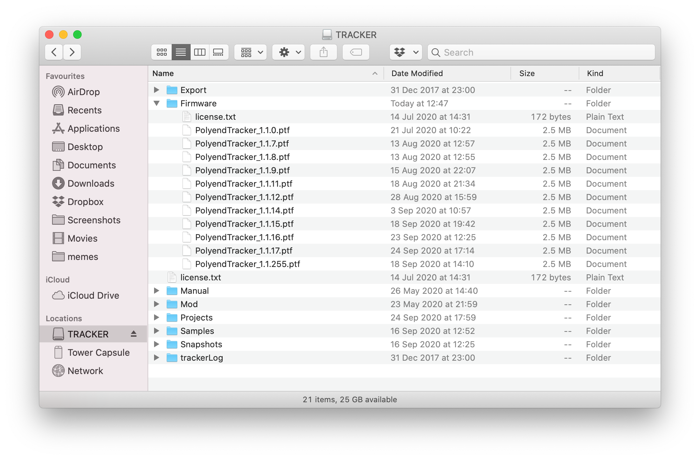
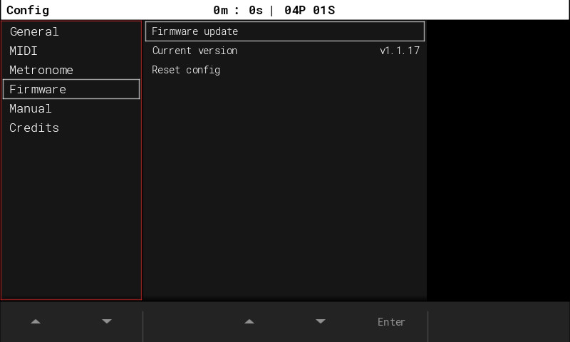
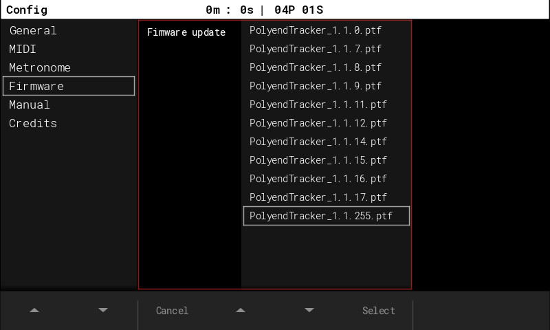
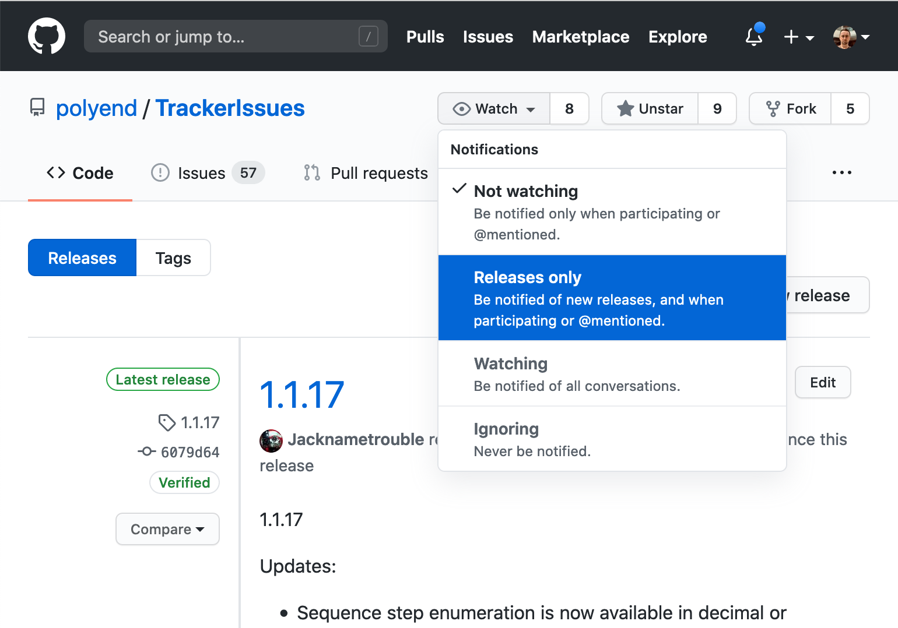

# Testing Pre-release Builds of the Tracker firmware

## Before you begin

Hi there! Are you interested in testing beta versions of the next
Tracker firmware?  Great, we're glad to hear that.  Let's just set
some expectations up-front: **beta releases are provided on an "as is"
basis**.  That means any of the following:

* they may introduce new bugs that may lead to loss of work or crashes
  during performance;

* they may introduce new features that will probably not be documented
  before the next stable release;

* they may change or remove previously existing features, both
  documented and undocumented; and

* they may change the data format of the projects or instruments you
  save, making it impossible to open them with an older firmware
  version.

If you find those risks acceptable, let's get you started!

## Download a .ptf file

You can find the latest `.ptf` files in the
[Releases](https://github.com/polyend/TrackerIssues/releases/) section
of this repository.  Note that the "Source Code" in each release doesn't
actually contain Tracker's sources but just this repository's files,
including the one you're reading now.

## Put the .ptf file on your SD card

In order to put the firmware `.ptf` file in the SD card Firmware/ folder 
next to other `.ptf` files, you can use:
* the bundled microSD USB adapter to connect the SD card to your computer, or
* (starting from 1.1.22) the MTP (Media Transfer Protocol) which lets you browse the files and
folders stored the SD card from a computer level. In order to use it activate 
the File Transfer mode in the Config menu. On Windows 10 you should see the 
device in Explorer. On macOS, you need to use the [Android File Transfer application](https://www.android.com/filetransfer/).
* the second emergency flashing procedure (explained at the very bottom of this doc),
when you have the [Polyend Tool](https://polyend.com/downloads/) already on your computer.

If you erased your card and don't have the latest stable firmware nor the factory content, get
it from [the Polyend website](https://polyend.com/downloads/) and [official SD card content](https://polyend.com/files/Tracker_SD_1_2_1.zip) link.

## Put the SD card back in your Tracker and go to Config

In the Firmware section you'll find a "Firmware update" feature. Enter
it.

## Select the firmware you want

After selecting the right file, press Select and wait for the upgrade to
finish.  You should see it progress through the file and restart the
device.

## How to get notified about new releases?

If you sign up for GitHub and subscribe to our TrackerIssues repository,
you'll get notified about new releases:

You can also sign up for our official
[Polyend Tracker group](https://www.facebook.com/groups/polyendtracker/)
on Facebook.

## If you find bugs

That's why we're testing! Report them
[here](https://github.com/polyend/TrackerIssues).

But first, if you're upgrading between beta releases, check the following:

* use the "Reset Config" feature in the Firmware section of the Config
  screen to ensure your problem wasn't related to some configuration
  format changes between beta releases;

* delete the hidden "Workspace" folder from your SD card to ensure your
  problem isn't caused by changed data formats;

* disconnect power from the device for a few seconds.

## In case of trouble

First and simplest action to try is to disconnect the USB C cable connector
from its port on the back panel of the instrument. This usually helps.

But if your device lost power during the upgrade, the SD file was damaged,
or the firmware doesn't boot up for any other reason, you can perform 
one of the two emergency flashing procedures as follows:

First method:
* just simply press the hidden reset button on the back panel of the
instrument and it will automatically flash with a randomly picked firmware 
`.ptf` file from the SD card Firmware/ folder.

Second method:
* download the Polyend Tool from 
  [the Polyend website](https://polyend.com/downloads/);

* download a known working firmware file either from the Polyend website
  or one of the previous beta `.ptf` files;

* **important:** remove the SD card from the Tracker; 

* connect your Tracker directly to your computer with a USB cable
  (avoid USB hubs and dongles);

* power up the Tracker;

* in the Polyend Tool, choose the `.ptf` file you want to flash with;

* use a pin to press the hidden Reset button next to the Tracker's
  USB C port;

* wait for the firmware update to complete;

* if it's at 100% but the device didn't reboot on its own, do it
  manually;

* re-insert the SD card to the Tracker's slot.

**important:** Unit is still crashing? 
Try this: connect your SD card to your computer
and delete the hidden "Workspace" folder.
